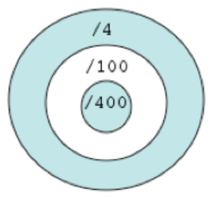

# Les années bissextiles ...

Pour déterminer si une année est bissextile, il faut appliquer les règles suivantes :
— Les années divisibles par 4 sont bissextiles,
— Exception : les années divisibles par 100 ne sont pas bissextiles,
— Exception à l’exception : les années divisibles par 400 sont bissextiles.
— Sauf application des règles ci-dessus, toute autre année n’est pas bissextile.

Il est possible de représenter graphiquement ces contraintes avec en bleu les zones pour lesquelles une année est
bissextile et en blanc pour celles qui ne le sont pas:

</img>

Concevez le programme `Bissextile` définissant la fonction booléenne `boolean estBissextile(int annee)`, qui détermine si une année donnée est bissextile (ou pas).

Pour vérifier le bon fonctionnement de votre fonction, ajoutez la fonction `algorithm()` afin d'afficher les 33 dernières années bissextiles en partant de 2022. Vous devriez obtenir l’affichage suivant :
```bash
2020 2016 2012 2008 2004 2000 1996 1992 1988 1984 1980 1976 1972 1968 1964 1960 1956 1952 1948 1944 1940 1936 1932 1928 1924 1920 1916 1912 1908 1904 1896 1892 1888
```

**Ce qui est proposé ensuite est optionnel**

Implémentez quatre résolutions différentes de la fonction précédente en respectant les contraintes suivantes :
1. avec quatre alternatives indépendantes (`estBissextile1`),
1. avec une seule alternative constituée d’une expression conditionnelle complexe (`estBissextile2`),
1. avec une cascade de si alors sinon en allant des conditions les plus spécifiques au plus générales (`estBissextile3`),
1. avec une cascade de si alors sinon en allant des conditions les plus générales au plus spécifiques (`estBissextile4`).
